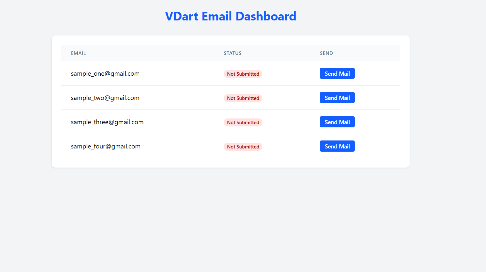
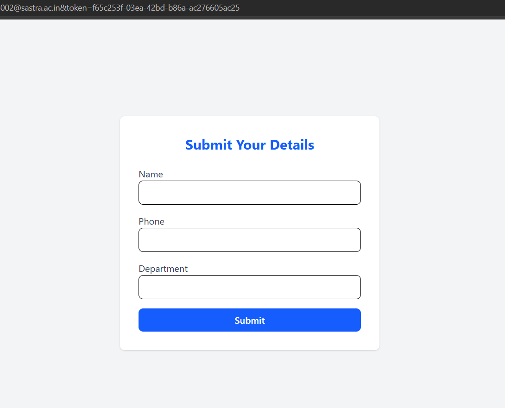

# VDart Project - Email Dashboard with Tokenized Form Submission

This is a full-stack application built with **Django REST Framework (backend)** and **React.js (frontend)**.
It allows administrators to:
✅ Fetch emails from Google Sheets.
✅ Send tokenized links via email.
✅ Collect form submissions tied to tokens.

---

## 🚀 Features
- Fetch and display emails with submission status.
- Send unique tokenized links to each user.
- Users submit their details securely.
- Data stored in **MongoDB**.
- Google Sheets integration for email lists.

---

## 🛠 Tech Stack
- **Backend:** Django, Django REST Framework, MongoDB
- **Frontend:** React.js, TailwindCSS
- **Database:** MongoDB Atlas
- **Other:** Google Sheets API, Nodemailer (for emails)

---

## ⚙️ Setup

### Backend
bash
cd backend
python -m venv env
source env/bin/activate  # On Windows: env\Scripts\activate
pip install Django==4.2 djangorestframework  pymongo google-api-python-client google-auth python-dotenv corsheaders

# Configure environment variables
cp .env.example .env

Create a .env file in your backend/vdart_api directory:

EMAIL_USER=your-email@gmail.com
EMAIL_PASS=your-app-password
GOOGLE_SHEET_ID=your-google-sheet-id
GOOGLE_CREDENTIALS_FILE=path-to-your-credentials.json
DOMAIN=your-domain

📸 Screenshots

### Dashboard

### Form Page

